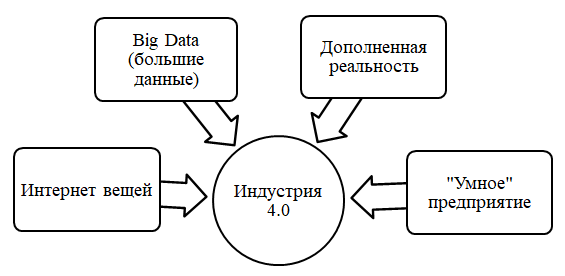

>   **МИНИСТЕРСТВО НАУКИ И ВЫСШЕГО ОБРАЗОВАНИЯ РОССИЙСКОЙ ФЕДЕРАЦИИ**

ФЕДЕРАЛЬНОЕ ГОСУДАРСТВЕННОЕ БЮДЖЕТНОЕ ОБРАЗОВАТЕЛЬНОЕ

УЧРЕЖДЕНИЕ ВЫСШЕГО ОБРАЗОВАНИЯ

«МОСКОВСКИЙ АВИАЦИОННЫЙ ИНСТИТУТ

(национальный исследовательский университет)»

**Факультет (институт, филиал)**  **№4**  **Кафедра 406**

**Направление подготовки**   **Радиотехника**  **Группа**  **М4В-302Б**

**Квалификация (степень)**   **\_____Бакалавриат_\_**

**РЕФЕРАТ**

На тему: Четвёртая промышленная революция - Industry 4.0.

Реферат сдал_Кирюшина Татьяна Валерьевна

Реферат принял Терехин Алексей Геннадиевич

Москва 2020

**ОГЛАВЛЕНИЕ**

[Введение	3](#_Toc59098481)

[1 Основные технологии четвертой промышленной революции	4](#_Toc59098482)

[2 Принципы построения четвертой промышленной революции	9](#_Toc59098483)

[Заключение	15](#_Toc59098484)

[Список использованных источников	16](#_Toc59098485)

ВВЕДЕНИЕ

Темпы современной жизни по сравнению жизнью предыдущих лет стали невероятно
высокими. Постоянные изменения уже не кажутся чем-то необычным, а стали нормой
современной обстановки как для людей, так и для бизнеса. Бизнесу теперь
приходится адаптироваться к огромному числу инноваций, которые происходят
практически постоянно, изменяя наполнение, ритм и структуру ведения деятельности
на рынке. Но в определенные моменты изменений становится особенно много:
экономика меняет вектор своего развития, и деформируются производственные
отношения. Название подобному феномену -промышленная революция.

Индустрия 4.0 - термин, который был предложен для обозначения четвертой
промышленной революции в 2011 г. на Ганноверской ярмарке. В узком смысле
«Индустрия 4.0» - это название одного из немецких государственных проектов,
направленных на создание автоматизированного производства на базе интернета
вещей. После нескольких международных конференций эта концепция получила
общемировое признание, а часть стран стала определять переход к новому
«цифровому» производству как приоритетное направление своего развития.

Таким образом, целью данной работы выступает исследование особенностей четвертой
промышленной революции.

В соответствии с поставленной целью в работе предстоит решить задачи:

\- описать основные технологии четвертой промышленной революции;

\- охарактеризовать принципы построения четвертой промышленной революции;

\- сделать выводы по работе в целом.

>   1 ОСНОВНЫЕ ТЕХНОЛОГИИ ЧЕТВЕРТОЙ ПРОМЫШЛЕННОЙ РЕВОЛЮЦИИ

Cyber-physical systems (Киберфизические системы) – это
организационно-техническая концепция управления информационными потоками,
интеграция вычислительных ресурсов в физические процессы производства. В такой
системе датчики, контроллеры и информационные системы объединены в единую сеть
на протяжении всего жизненного цикла изделия. Кибер-физическая сеть может быть,
как в рамках одного предприятия, так и в рамках динамической бизнес-модели в
составе которой несколько предприятий. Операции на протяжении всего жизненного
цикла взаимодействуют друг с другом с помощью стандартных интернет-протоколов
для управления, планирования, самонастройки и адаптации к изменениям.

Ключевые технологические тенденции, лежащие в основе киберфизических систем
представлены на рисунке 1.1. Изолированно они уже используются в разных сферах,
но будучи интегрированными в единое целое, они меняют существующие отношения
между производителями, поставщиками и покупателями, а также между человеком и
машиной.

Рисунок 1.1 - Технологии Индустрии 4.0

Big Data (Большие Данные). Это совокупность подходов, инструментов и методов
обработки структурированных и неструктурированных данных больших объёмов и
значительного многообразия для получения воспринимаемых человеком или
компьютерной системой результатов, эффективных в условиях непрерывного прироста,
распределения по многочисленным узлам вычислительной сети.

Огромный массив цифровой информации представляет собой среду, в которой находят
отражение различные события реального мира, в явном виде в информацию не
записанные. Человек способен на распознавание этих событий, однако лишь при
удобном отображении и на обозримых масштабах информации. Например, человек
способен идентифицировать наличие предмета на фотографии, но не справится, если
перед ним будут миллионы фотографий. Для работы на таком масштабе данных
становится целесообразным машинными методами обработать и переструктурировать
массив цифровой информации, высветив явным образом интересующее событие.
Идентификация и характеризация событий позволяет принимать решения на их основе,
в т.ч. автоматические.

Big Data представляет собой набор данных из традиционных и цифровых источников
внутри и за пределами компании. Данные собираются везде: от датчиков,
сотрудников компании, компаний-контрагентов, клиентов, сервисных центров,
поставщиков и т.д., поле чего данные структурируются, анализируются и
используются. Основная задача предприятий при работе с Big Data, наилучшим
образом интерпретировать данные для дальнейшего использования.

VVV – совокупность определяющих характеристик больших Big Data:

-   Volume (объём) – величина физического объёма данных

-   Velocity (скорость) – скорость прироста объёма данных

-   Variety (многообразие) – одновременная обработка различных типов данных,
    структурированных и неструктурированных[^1].

    [^1]: Демьянова О.В. Информационные технологии // Проблемы современной
        экономики. – 2018. − №1 (33).

Информационноёмкие производственные системы имеют свойства лавинообразного
потока, количество данных постоянно возрастает, многообразие информации
расширяется. Управлять, структурировать, интерпретировать, анализировать и
использовать данные – одна из основных наиважнейших задач организации
производства в концепции Industry 4.0.

2. Интернет вещей**.** Интернет вещей – это концепция вычислительной сети
физических предметов (вещей), оснащённых встроенными технологиями для
взаимодействия друг с другом или с внешней средой, рассматривающая организацию
таких сетей как явление, способное перестроить экономические и общественные
процессы, исключающее из части действий и операций необходимость участия
человека.

Интернет вещей связывает вещи, подключённые к интернету друг с другом и
обеспечивает их совместную работу, управляемую облачными вычислительными
системами. Интернет вещей обеспечивает взаимодействие физических
производственных операций и сопутствующих процессов.

Возможность автоматически принимать рутинные решения обеспечивается развитой
системой «коммуникации» вещей, которая предполагает способность вещей друг друга
идентифицировать, характеризовать состояние, передавать друг другу данные и
обрабатывать их. Возможность рутинных решений позволяет исключить человека из
взаимодействия вещей, тем самым сделав это взаимодействие более автономным,
надёжным, быстрым, системным и контролируемым. Будучи внедрённым в индустрии
(т.н. Индустрия 4.0), интернет вещей даёт производству сразу несколько
преимуществ:

-   гибкость производства достигается отказом от жёстких «конвейерных» решений,
    что в конечном счёте позволяет массово принимать и выполнять индивидуальные
    заказы, свободней внедрять в производство новые решения, свободно
    использовать аутсорсинг;

-   настраиваемость производства достигается за счёт его контроля на всех
    уровнях и благодаря его функционированию на единой технологической
    платформе;

-   эффективность производства связана со снижением издержек, связанных с
    человеческим фактором: ошибок, простоев, высокой стоимости человеческого
    труда[^2].

    [^2]: Гулин К.А. О роли интернета вещей в условиях перехода к четвертой
        промышленной революции // Проблемы развития территории. – 2017. – №4. –
        № (90). – С. 112.

Наполнение концепции «интернета вещей» многообразным технологическим содержанием
и внедрение практических решений для её реализации начиная с 2010-х годов
является устойчивой тенденцией в развитии информационных технологий, прежде
всего, благодаря повсеместному распространению беспроводных сетей, появлению
облачных вычислений, развитию технологий межмашинного взаимодействия, началу
активного перехода на IPv6 и освоению программно-конфигурируемых сетей.

В июле 2014 года Intel, Samsung Electronics, Dell, Broadcom и другие ИТ-компании
создали некоммерческое объединение под названием Open Interconnect Consortium.
Его цель — разработка стандартов «интернета вещей», которые позволят устройствам
разных производителей передавать друг другу информацию, что сделает идею
«Интернета вещей» более эффективной. Open Interconnect Consortium начал с
разработок в сфере бытовой и офисной техники.

3. Дополненная реальность – это результат введения в поле восприятия любых
сенсорных данных с целью дополнения сведений об окружении и улучшения восприятия
информации. Эта технология находится в начальной стадии своего развития, но в
будущем позволит работникам ускорить принятие решений. Например, работник может
получить инструкцию как починить или заменить сломанную деталь в
производственной системе, когда он на неё смотрит через очки дополненной
реальности.

4. SMART Factory («Умный» завод). Термин Smart Factory используют
преимущественно в англоязычной среде, он соответствует немецкому термину –
Intelligente Fabrik. В русскоязычной среде, эти термины чаще всего переводят как
«Умное производство» или «Умный завод», что в принципе является не совсем
верным, более релевантным определением является «Продуманное производство».

В основе концепции Smart Factory – бесшовное соединение отдельных этапов
(операций) производственного процесса, от стадии проектирования изделий и
планирования использования производственных ресурсов к исполнительным механизмам
в полевых условиях.

В обозримом будущем, концепция Smart Factory существенно изменится с развитием
адаптивных когнитивных систем. Применение в производстве систем на основе
искусственного интеллекта настолько изменит производство, как вид деятельности
человека, что новые технологии организации производства на основе адаптивных
когнитивных систем, можно будет по праву считать пятой промышленной
революцией[^3].

[^3]: Шаньгин В. Ф. Информационная безопасность компьютерных систем и сетей /
    В.Ф. Шаньгин. - М.: Форум, Инфра-М, 2017. – С. 238.

# **2 ПРИНЦИПЫ ПОСТРОЕНИЯ ЧЕТВЕРТОЙ ПРОМЫШЛЕННОЙ РЕВОЛЮЦИИ**

Немецкие ученые сформулировали несколько основных принципов построения Индустрии
4.0, следуя которым компании могут внедрять сценарии четвертой промышленной
революции на своих предприятиях.

Первый – это совместимость, что означает способность машин, устройств, сенсоров
и людей взаимодействовать и общаться друг с другом через интернет вещей (IoT).

Это ведет к следующему принципу – прозрачности, которая появляется в результате
такого взаимодействия. В виртуальном мире создается цифровая копия реальных
объектов, систем функций, которая точно повторяет все, что происходит с ее
физическим клоном. В результате накапливается максимально полная информация обо
всех процессах, которые происходят с оборудованием, «умными» продуктами,
производством в целом и так далее. Для этого требуется обеспечить возможность
сбора всех этих данных с сенсоров и датчиков и учета контекста, в котором они
генерируются.

Техническая поддержка – третий принцип Индустрии 4.0. Суть его в том, что
компьютерные системы помогают людям принимать решения благодаря сбору, анализу и
визуализации всей той информации, о которой говорится выше. Эта поддержка также
может заключаться в полном замещении людей машинами при выполнении опасных или
рутинных операций.

Четвертый принцип – децентрализация управленческих решений, делегирование
некоторых из них киберфизическим системам. Идея в том, чтобы автоматизация была
настолько полной, насколько это вообще возможно: везде, где машина может
эффективно работать без вмешательства людей, рано или поздно должно произойти
человекозамещение. Сотрудникам при этом отводится роль контролеров, которые
могут подключиться в экстренных и нестандартных ситуациях[^4].

[^4]: Гулин К.А., Усков В.С. Тренды четвертой промышленной революции //
    Экономические и социальные перемены: факты, тенденции, прогноз. - 2017. - Т.
    10. - № 5. - С. 216.

В результате перехода промышленности на эти принципы происходит также изменение
в бизнес-моделях. Так, вместо фокуса на бережливом производстве компании
стремятся внедрять выпуск персонализированной массовой продукции по принципам
Agile и переходить на выпуск партий размером с один-единственный продукт. При
этом сохраняется принцип экономии: роботизированное производство более
энергоэффективно, сопровождается меньшим количеством отходов и брака.

Проект «Индустрия 4.0» базируется на идеях «интернета вещей» - IoT (Internet of
things) и «киберфизических систем» - CPS (Cyber-Physical Systems).

Речь идет о превращении неодушевленных предметов (в данном случае – компонентов
производственной системы) в активных пользователей интернет. Уже сегодня многие
«умные» системы могут выходить в сеть без участия человека – вспомним «умный
дом», современные автомобили, интеллектуальные парковки, системы экомониторинга,
энергообеспечения. Количество подключенных к сети устройств в ближайшее время
превысит численность населения планеты, а к 2022 году по прогнозам аналитиков –
составит 26 миллиардов[^5].

[^5]: Шваб К. Четвертая промышленная революция: монография: пер. с англ. / К.
    Шваб. – М: Изд-во «Э», 2017. – С. 132.

Для производства возможность различных компонентов общаться через сеть открывает
невероятные перспективы. В «умных фабриках» машины будут понимать свое окружение
и смогут общаться по единому сетевому протоколу между собой, а также с
логистическими и бизнес-системами поставщиков и потребителей. Производственное
оборудование, получая сведения об изменившихся требованиях, сможет само вносить
корректировки в технологический процесс. В результате производственные системы
станут способны к самооптимизации и самоконфигурации, оборудование будет
осуществлять самодиагностику, произойдет дальнейшее повышения гибкости и
индивидуализации продукции.

Заготовка сможет сообщать станку какие именно операции необходимы для ее
обработки и какой инструмент выбрать, а транспортной системе – по какому
маршруту следует ее передать для последующей операции. Детали агрегатов смогут
сами сигнализировать о своем износе и передавать через интернет заказы
изготовителям запчастей и предупреждать службы сервиса о планируемых ремонтах.

Одним из наиболее ощутимых аспектов четвертой промышленной революции является
идея «сервис-ориентированного проектирования». Оно может варьироваться от
пользователей, использующих заводские настройки для производства собственных
продуктов, до компаний, которые поставляют индивидуальные продукты
индивидуальным потребителям. Концепцию Индустрии 4.0 часто изображают в виде
математического знака бесконечности – он иллюстрирует этот бесконечный цикл
взаимодействия производителя с продуктом и с клиентом.

Индустрия 4.0, благодаря гибкости и адаптивности, обеспечиваемой
киберфизическими системами, помогает реализовать массовое производство по
индивидуальным заказам (нем. «Losgrösse = 1» – «размер партии = 1»), что
позволит снизить цену продукции. Классические методы организации производства
предполагали, что поточным методом можно изготавливать только большие партии
товаров. Благодаря новым принципам организации производственных процессов,
становится возможным индустриальным способом изготавливать и единичные изделия.

Предприятиям, привыкшим производить одинаковые вещи, приходится перестраиваться.
Внедрение принципов Индустрии 4.0 позволяет получить ряд преимуществ,
недоступных в традиционных моделях прошлого. Например, теперь компании могут
достичь индивидуального подхода и персонализировать заказы согласно личным
предпочтениям клиентов, что резко повышает их лояльность. Старые заводы и
фабрики превращаются в «умные» и начинают выпускать буквально штучные продукты
по индивидуальному заказу. При этом снижаются удельные затраты на производство
единицы продукции, компании получают возможность производить уникальный
персонализированный продукт по стоимости массового стандартизированного
продукта.

Производитель же получает возможность предлагать клиентам большое количество
уникальных опций для своего продукта, что дает дополнительный источник прибыли и
повышает маржинальность бизнеса.

По индивидуальному заказу могут выпускаться и двигатели, и серверы, и вообще все
что угодно. На заводе Fujitsu Siemens в немецком городе Аугсбург выпускаются
компьютерные системы и серверы буквально поштучно под конкретного заказчика[^6].

[^6]: Гулин К.А., Усков В.С. Тренды четвертой промышленной революции //
    Экономические и социальные перемены: факты, тенденции, прогноз. - 2017. - Т.
    10. - № 5. - С. 217.

Затраты на выпуск продукции по индивидуальному заказу на предприятии с глубокой
автоматизацией невелики: если в прошлом под каждую такую пару кроссовок пришлось
бы перенастраивать оборудование руками, то сегодня это делает компьютерная
система сама и за считаные секунды. Роботизация заводов Tesla, выпускающих
электромобили, позволила компании развернуть производство не в Китае, а в
Калифорнии. Это оказалось дешевле, чем использовать труд китайских рабочих, а
потом платить за транспортировку готовых машин. Четвертая промышленная
революция, как видно, меняет не только бизнес отдельных компаний, она влияет на
расстановку сил на глобальном уровне. Кто бы мог подумать, что производитель
автомобилей, которому чуть более десятка лет – Tesla основана в 2008 году, –
обгонит по капитализации лидера второй промышленной революции, которая произошла
в результате изобретения конвейера и перехода на массовое производство, – Ford
Motors[^7].

[^7]: Шваб К. Четвертая промышленная революция: монография: пер. с англ. / К.
    Шваб. – М: Изд-во «Э», 2017. – С. 156.

Уже сегодня наблюдается устойчивая тенденция к переходу от жесткого
централизованного управления производственными процессами к децентрализованной
модели сбора, обработки информации и принятия решений. Причем уровень
автономности непрерывно растет. В конечном итоге такая система становится
активным компонентом, способным самостоятельно управлять своим производственным
процессом.

В России внедрение новых технологий началось примерно в одно время с другими
странами. Однако, учитывая масштабы государства и бюрократическую систему,
раскачка оцифровывания производства в качестве общегосударственной идеи
продвигается довольно медленно.

По аналогии с проектом «Индустрия 4.0» в Германии, нацеленным на укрепление и
повышение конкурентоспособности немецких производственных предприятий на мировом
рынке, в России сформирована Национальная технологическая инициатива (НТИ) (при
участии Агентства стратегических инициатив (АСИ), Российской Венчурной компании
(РВК)), целью которой являются формирование кардинально новых рынков и создание
условий для глобального технологического лидерства России к 2035 году[^8].

[^8]: Гулин К.А., Усков В.С. Тренды четвертой промышленной революции //
    Экономические и социальные перемены: факты, тенденции, прогноз. - 2017. - Т.
    10. - № 5. - С. 218.

Задачами НТИ являются разработка дорожных карт развития ключевых отраслей, а
также финансовая и организационная поддержка важнейших стратегических проектов
компаний и научных организаций. В настоящее время созданы ассоциации,
способствующие развитию «Промышленного интернета» и Интернета вещей в России.
Они выполняют роль компетентных консультантов в различных отраслях и инициаторов
разработки стандартов и нормативно-правовых документов. В стратегии развития
крупных российских компаний отражено применение технологий «Индустрии 4.0»,
такая тенденция наблюдается во многих отраслях промышленности: нефтегазовой
индустрии, машино-строении, энергетике, транспорте, медицине и т.д.

Все эти факты свидетельствуют о том, что в ближайшие 3–5 лет в России должен
сформироваться рынок с огромным потенциалом, способный, во-первых, сдержать
отток квалифицированных специалистов и повысить качество разработки аппаратных
решений, во-вторых, предоставить возможность массового применения инновационных
технологий на базе подготовленных и локализованных отраслевых стандартов.

# **ЗАКЛЮЧЕНИЕ**

Таким образом, в заключении следует сделать выводы по рассмотренной теме.

Термин «Индустрия 4.0» используется как синоним четвертой промышленной
революции. Ее суть в том, что сегодня материальный мир соединяется с
виртуальным, в результате чего рождаются новые киберфизические комплексы,
объединенные в одну цифровую экосистему. Роботизированное производство и «умные»
заводы — один из компонентов трансформированной отрасли.

Четвертая промышленная революция означает все большую автоматизацию абсолютно
всех процессов и этапов производства: цифровое проектирование изделия, создание
его виртуальной копии, совместная работа инженеров и дизайнеров в едином
цифровом конструкторском бюро, удаленная настройка оборудования на заводе под
технические требования для выпуска этого конкретного «умного» продукта,
автоматический заказ необходимых компонентов в нужном количестве, контроль их
поставки, мониторинг пути готового продукта от склада на фабрике до магазина и
до конечного клиента. Но и после продажи производитель не забывает о своем
продукте, как это было раньше в классической модели: он контролирует условия
использования, может менять настройки удаленно, обновлять программное
обеспечение, предупреждать клиента о возможных поломках, а под конец цикла
использования — принимать продукт на утилизацию.

Изменения, которые происходят в промышленности под воздействием информационных
технологий, помогают значительно увеличить качество выпускаемой продукции и
услуг. Это повышает лояльность и удовлетворенность клиентов. Производители также
не остаются внакладе: новые подходы и бизнес-модели, которые рождаются в
Индустрии 4.0, позволяют им больше зарабатывать, а значит, инвестировать в
улучшение продукции.

# **СПИСОК ИСПОЛЬЗОВАННЫХ ИСТОЧНИКОВ**

1.  Гулин К.А. О роли интернета вещей в условиях перехода к четвертой
    промышленной революции // Проблемы развития территории. – 2017. – №4. – №
    (90). – С. 112-131.

2.  Гулин К.А., Усков В.С. Тренды четвертой промышленной революции //
    Экономические и социальные перемены: факты, тенденции, прогноз. - 2017. - Т.
    10. - № 5. - С. 216-221.

3.  Демьянова О.В. Информационные технологии // Проблемы современной экономики.
    – 2018. − №1 (33).

4.  Шаньгин В. Ф. Информационная безопасность компьютерных систем и сетей / В.Ф.
    Шаньгин. - М.: Форум, Инфра-М, 2017. - 416 c.

5.  Шваб К. Четвертая промышленная революция: монография: пер. с англ. / К.
    Шваб. – М: Изд-во «Э», 2017. – 208 с.
